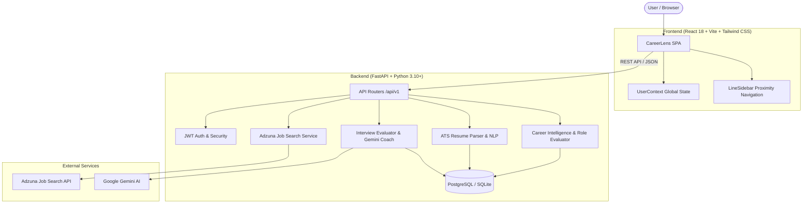

# CareerLens — AI Resume Screening & Career Coach

> **CareerLens** is an intelligent, full-stack career navigation and acceleration platform. It empowers students, developers, and professionals to audit resumes against ATS standards, align with specific target career roles, discover matched live vacancies via Adzuna, close skill gaps through phased learning roadmaps, practice with AI mock interviews, and receive personalized guidance from an AI Career Coach.

---

## Core System Modules

### 1. Target-Role Career Intelligence & Recommendation Engine
* **Target-Role Centric Job Matching**: Prioritizes genuine role relevance first (e.g. *Data Engineer*, *ETL Developer*, *Data Platform Engineer*) before evaluating skill overlap, ensuring candidates are recommended real opportunities aligned with their career trajectory.
* **Separation of Role Relevance & Skill Overlap**: Distinctly evaluates whether a vacancy belongs to the candidate's career domain (`Direct Match` vs `Related Opportunity`) while providing a transparent skill match percentage (`XX% skill match`).
* **Global Target Role Synchronization**: Instant real-time state synchronization across all modules (Dashboard, Skills Matrix, Learning Roadmap, Mock Interview Prep, and Career Coach).

### 2. Executive Career Readiness Dashboard
* **Real-Time Composite Readiness Score**: Weighted readiness score integrating ATS audit results (35%), target-role job match (20%), skill gap closure (20%), roadmap progress (10%), and mock interview performance (15%).
* **Curated Job Recommendations**: Displays the top 1–2 most relevant openings with itemized matched skills and missing competencies to learn.
* **Chronological Activity Feed**: Tracks uploaded resumes, job applications, and completed mock interview evaluations.
* **Proximity-Driven LineSidebar**: Smooth interactive navigation with vertical cursor proximity animations.

### 3. Resume Intelligence & ATS Diagnostics
* **Multi-Format Document Parsing**: High-fidelity text extraction from both `.pdf` and `.docx` resumes.
* **Comprehensive Section & Keyword Audit**: Analyzes summary, work experience, education, skills, and projects with structural scoring and keyword density metrics.
* **Job-Specific ATS Match Comparator**: Test any resume against custom target job descriptions to identify missing keywords and formatting improvements.

### 4. My Skills & Competency Matrix
* **Automated Skill Extraction**: Automatically parses programming languages, frameworks, cloud platforms, databases, and engineering methodologies.
* **Custom Skills Management**: Add or remove specialized competencies with custom proficiency ratings and persistent database storage.
* **Live Skill Gap Calculation**: Side-by-side comparison between candidate skills and target role requirements.

### 5. Live Adzuna Job Search & Application Tracker
* **Direct Adzuna API Integration**: Search thousands of live vacancies with filters for title, keywords, location, country code, and salary range.
* **Personalized Skill Match Scoring**: Real-time evaluation of job requirements against verified resume skills.
* **1-Click Application Tracker**: Save jobs and manage pipeline status (`Saved`, `Applied`, `Interviewing`, `Offer Received`, `Archived`) with personal notes.

### 6. Phased Learning Roadmap
* **Personalized Curriculum Generation**: Auto-generates structured milestones designed to close detected skill gaps.
* **Verified Baseline Recognition**: Credits existing strengths in Phase 1 and schedules missing competencies in sequential learning phases.
* **Interactive Milestone Tracking**: Check off completed learning phases with instant database persistence and progress recalculation.

### 7. AI Mock Interview Simulator
* **Role-Specific Question Generation**: Dynamically serves technical and behavioral interview questions tailored to the candidate's target role.
* **Instant Evaluation & Scoring**: Evaluates candidate responses out of 100 with identified strengths, missing points, and actionable improvement feedback.
* **Session History & Analytics**: Revisit past interview sessions to track performance improvement over time.

### 8. Context-Aware AI Career Coach
* **Personalized Mentorship**: Leverages the user's analyzed resume, detected skills, target role, and roadmap to provide tailored advice.
* **Powered by Gemini AI**: Integrates Google Gemini with deterministic heuristic fallbacks for high reliability.
* **Prompt Acceleration Chips**: 1-click prompt chips for rapid guidance on portfolio projects, resume optimization, and interview preparation.

---

## System Architecture



---

## Tech Stack

| Layer | Technologies |
|---|---|
| **Frontend** | React 18, Vite, Tailwind CSS v4, Lucide Icons, Recharts, React Bits (LineSidebar), Axios, React Router v6 |
| **Backend** | FastAPI, Python 3.10+, SQLAlchemy, Pydantic v2, PyPDF2, python-docx, Passlib, Bcrypt |
| **Database** | PostgreSQL / SQLite (via SQLAlchemy ORM with auto-schema sync) |
| **Authentication**| JWT Bearer Tokens with SHA-256 password hashing |
| **External APIs** | Adzuna Live Jobs API, Google Gemini AI (1.5 Flash) |

---

## Repository Structure

```text
CareerLens/
├── backend/
│   ├── database.py                 # Database engine & automatic schema sync
│   ├── models.py                   # SQLAlchemy ORM entity models
│   ├── schemas.py                  # Pydantic validation models
│   ├── crud.py                     # Data operations & dashboard recommendation pipeline
│   ├── config.py                   # Environment settings & credentials
│   ├── dependencies.py             # FastAPI dependency injections & auth guards
│   ├── security.py                 # Password hashing & JWT token verification
│   ├── main.py                     # FastAPI application entrypoint & middleware
│   ├── routers/
│   │   ├── auth.py                 # Registration & login endpoints
│   │   ├── users.py                # Profile, goals, skills, dashboard endpoints
│   │   ├── resumes.py              # Resume upload & ATS analysis
│   │   ├── jobs.py                 # Live Adzuna job search & application tracking
│   │   ├── career.py               # Career roadmaps & AI Career Coach
│   │   ├── interview.py            # Mock interview sessions & evaluations
│   │   └── matching.py             # Resume-to-job comparator
│   ├── services/
│   │   ├── career_intelligence.py  # Target-role relevance evaluator & roadmap generator
│   │   ├── resume_intelligence.py  # PDF/DOCX parsing & ATS section audit
│   │   ├── adzuna_service.py       # Live Adzuna API integration
│   │   └── gemini_service.py       # AI Career Coach & Mock Interview grader
│   └── tests/                      # Pytest automated test suite (22 tests)
└── frontend/
    ├── src/
    │   ├── components/
    │   │   ├── common/             # LineSidebar, Layout, GlassCard, Button
    │   │   ├── navbar/             # Top navigation bar & mobile menu toggle
    │   │   ├── sidebar/            # Interactive navigation with LineSidebar
    │   │   ├── dashboard/          # Dynamic dashboard metrics & recommended jobs
    │   │   └── landing/            # Landing page hero & feature showcases
    │   ├── context/
    │   │   └── UserContext.jsx     # Global synchronized target-role context
    │   ├── pages/
    │   │   ├── Dashboard.jsx       # Main executive career overview
    │   │   ├── SkillsDashboard.jsx # Skills catalog & gap analysis matrix
    │   │   ├── ResumeAnalyzer.jsx  # Resume upload & ATS scanner
    │   │   ├── JobRecommendations.jsx # Live Adzuna search & tracker
    │   │   ├── CareerRoadmap.jsx   # Interactive phased learning roadmap
    │   │   ├── CareerCoach.jsx     # AI Career Coach chat interface
    │   │   ├── InterviewPrep.jsx   # Mock interview simulator & evaluation
    │   │   ├── Profile.jsx         # Profile & career goal management
    │   │   └── Settings.jsx        # Account & search preference settings
    │   └── services/               # API service clients
```

---

## Getting Started

### Prerequisites
* Python 3.10+
* Node.js 18+ and npm
* PostgreSQL database instance (or SQLite for local development)

---

### Backend Setup

1. **Navigate to the backend directory and set up a virtual environment**:
   ```bash
   cd backend
   python -m venv venv
   ```

2. **Activate the virtual environment**:
   * Windows (PowerShell):
     ```powershell
     .\venv\Scripts\Activate.ps1
     ```
   * Linux / macOS:
     ```bash
     source venv/bin/activate
     ```

3. **Install dependencies**:
   ```bash
   pip install -r requirements.txt
   ```

4. **Configure Environment Variables**:
   Create a `.env` file in the `backend/` directory:
   ```env
   DATABASE_URL=sqlite:///./careerlens.db
   SECRET_KEY=your_secure_jwt_secret_key_here
   ALGORITHM=HS256
   ACCESS_TOKEN_EXPIRE_MINUTES=1440

   # Adzuna API (Get free keys at https://developer.adzuna.com/)
   ADZUNA_APP_ID=your_adzuna_app_id
   ADZUNA_APP_KEY=your_adzuna_app_key
   ADZUNA_COUNTRY=in

   # Optional Google Gemini AI
   GEMINI_API_KEY=your_gemini_api_key
   GEMINI_MODEL=gemini-1.5-flash
   ```

5. **Start the FastAPI backend server**:
   ```bash
   python -m uvicorn backend.main:app --host 0.0.0.0 --port 8000 --reload
   ```
   *Backend will be running at [http://localhost:8000](http://localhost:8000).*
   *Interactive Swagger API documentation is available at [http://localhost:8000/docs](http://localhost:8000/docs).*

---

### Frontend Setup

1. **Navigate to the frontend directory**:
   ```bash
   cd frontend
   ```

2. **Install frontend dependencies**:
   ```bash
   npm install
   ```

3. **Start the Vite development server**:
   ```bash
   npm run dev
   ```
   *Frontend will be running at [http://localhost:5173](http://localhost:5173).*

---

## Testing & Verification

### Run Backend Automated Tests
```powershell
.\backend\venv\Scripts\python.exe -m 
uvicorn backend.main:app --host 0.0.0.0 --port 8000 --reload

```
*All 22 integration and unit tests validate authentication, target-role recommendations, skill gap calculations, career roadmaps, interview evaluations, and user isolation.*

### Run Frontend Production Build
```bash
cd frontend
npm run build
```

---

## API Endpoint Reference

| HTTP Method | Endpoint | Description |
|---|---|---|
| `POST` | `/api/v1/auth/register` | Register new user account |
| `POST` | `/api/v1/auth/login` | Authenticate and retrieve JWT token |
| `GET` | `/api/v1/users/me` | Fetch authenticated user profile |
| `PUT` | `/api/v1/users/me` | Update profile information |
| `PUT` | `/api/v1/users/me/target-goal` | Update target career role and benchmark score |
| `GET` | `/api/v1/users/me/dashboard` | Fetch executive dashboard metrics & curated recommendations |
| `GET` | `/api/v1/users/me/skills` | Get categorized skills matrix and gap breakdown |
| `POST` | `/api/v1/users/me/skills` | Add/update custom skill and proficiency score |
| `DELETE` | `/api/v1/users/me/skills/{name}` | Delete custom skill |
| `POST` | `/api/v1/resumes/upload` | Upload and parse `.pdf`/`.docx` resume |
| `GET` | `/api/v1/resumes/{id}/analysis` | Get ATS score, section audit, and keywords |
| `GET` | `/api/v1/jobs/search` | Search live Adzuna vacancies with personalized skill matching |
| `POST` | `/api/v1/jobs/save` | Save vacancy to application tracker |
| `GET` | `/api/v1/jobs/saved` | List saved vacancies and tracked applications |
| `PATCH` | `/api/v1/jobs/saved/{id}/status` | Update job application pipeline stage |
| `DELETE` | `/api/v1/jobs/saved/{id}` | Delete saved job |
| `POST` | `/api/v1/career/roadmap` | Generate phased learning roadmap for target role |
| `GET` | `/api/v1/career/roadmap` | Retrieve active user career roadmap |
| `PATCH` | `/api/v1/career/roadmap/{id}/phase/{idx}` | Update milestone phase completion status |
| `POST` | `/api/v1/career/coach/ask` | Chat with context-aware AI Career Coach |
| `POST` | `/api/v1/interview/start` | Start tailored mock interview session |
| `POST` | `/api/v1/interview/evaluate` | Submit answer for instant AI evaluation & grading |
| `GET` | `/api/v1/interview/sessions` | Fetch user mock interview history |

---

## License
Distributed under the **MIT License**.
Built for career acceleration.